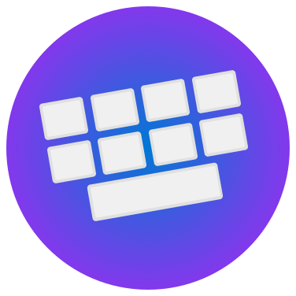

<div align="center">



# Maui Keyboard Effects

**Custom Keyboard Effects for MAUI Android and iOS**

[](https://www.nuget.org/packages/EightBot.MauiKeyboardEffects/)
[](LICENSE)
[](https://dotnet.microsoft.com/download)

_A lightweight library that gives .NET MAUI apps platform-native numeric keyboards with feature parity across iOS and Android._

[Features](#features) •
[Getting Started](#Getting-Started) •
[Attached Properties](#Attached-Properties) •
[Contributing](#contributing)

</div>

---

## Overview

 The project ships with turnkey effects, polished UI, and a sample app you can use as a reference.

## Features
- **iOS numeric keyboards**: traditional four-column layout, reusable horizontal variant, next/done controls, optional auxiliary buttons.
- **Android numeric keyboards**: Gboard-inspired styling, light/dark theme awareness, optional horizontal layout, optional button slot, decimal toggle, reusable keyboard host.
- **Simple attached properties**: toggle horizontal mode, supply optional button text/actions, specify next-return behavior, wire custom next button callbacks.
- **Sample app**: demonstrates vertical and horizontal keyboards, theming, and effect registration.

## Getting Started
1. Install the package (coming soon via NuGet) by referencing `EightBot.MauiKeyboardEffects` in your MAUI project.
2. Register the effect inside `MauiProgram.cs`:
   ```csharp
   builder
       .UseMauiApp<App>()
       .UseKeyboardEffects();
   ```
3. Add the effect to any `Entry` or `Editor`:
   ```xml
   xmlns:mke="http://maui.keyboard.effects/eightbot/2099"

   <Entry Placeholder="Numeric Keyboard"
          mke:NumericKeyboardEffect.IsHorizontal="False">
       <Entry.Effects>
           <mke:NumericKeyboardRoutingEffect />
       </Entry.Effects>
   </Entry>
   ```

## Attached Properties
| Property | Type | Description |
| --- | --- | --- |
| `NumericKeyboardEffect.IsHorizontal` | `bool` | Switches between stacked keypad and horizontal strip layouts. |
| `NumericKeyboardEffect.IsNextReturn` | `bool` | Turns the primary action button into "Next" and attempts to focus the next control. |
| `NumericKeyboardEffect.NextButtonAction` | `Action?` | Override the default "Next" behavior with your own callback. |
| `NumericKeyboardEffect.OptionalButton1Text` | `string?` | Sets the caption for the optional side button. |
| `NumericKeyboardEffect.OptionalButton1Action` | `Action?` | Runs when the optional button is tapped (only shown when both text and action are supplied). |

## Platform Notes
- **iOS**: builds on `UIInputView`, reuses UIKit queues for performance, mirrors system input accessory bar behavior, and supports both numeric pad and horizontal strip.
- **Android**: renders a custom view anchored to the activity root, blocks the system keyboard, tracks theme changes through `Application.RequestedThemeChanged`, and offers ripple-backed keys plus decimal toggle.

## Sample App
`MauiKeyboardEffectsTestApp` demonstrates how to register the effect, toggle layouts, and exercise optional buttons. Run it with:
```bash
cd MauiKeyboardEffects
dotnet build MauiKeyboardEffects.sln
```
Deploy to an iOS simulator or Android emulator to see each keyboard in action.

## Contributing
Issues and pull requests are welcome! Please:
1. File an issue outlining the bug/feature.
2. Fork the repo and create a feature branch.
3. Add tests or sample updates when applicable.
4. Submit a PR referencing the issue and describing your changes.

## License
This project is licensed under the [MIT License](LICENSE).
